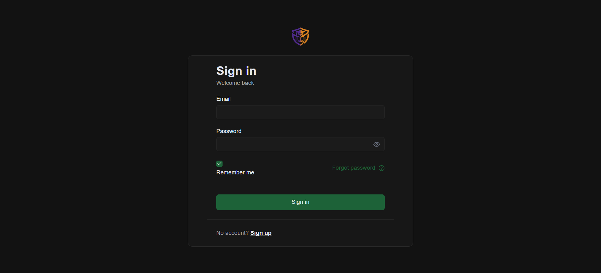
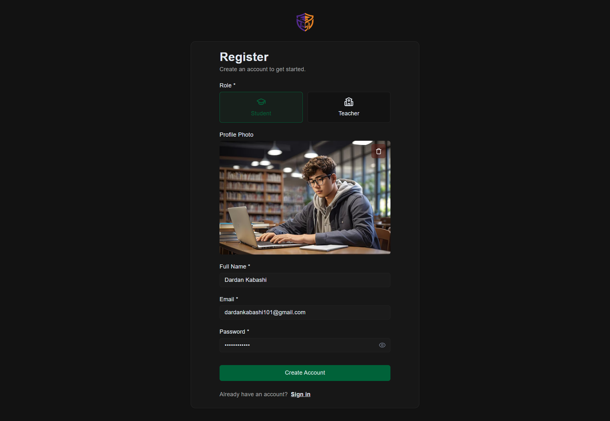
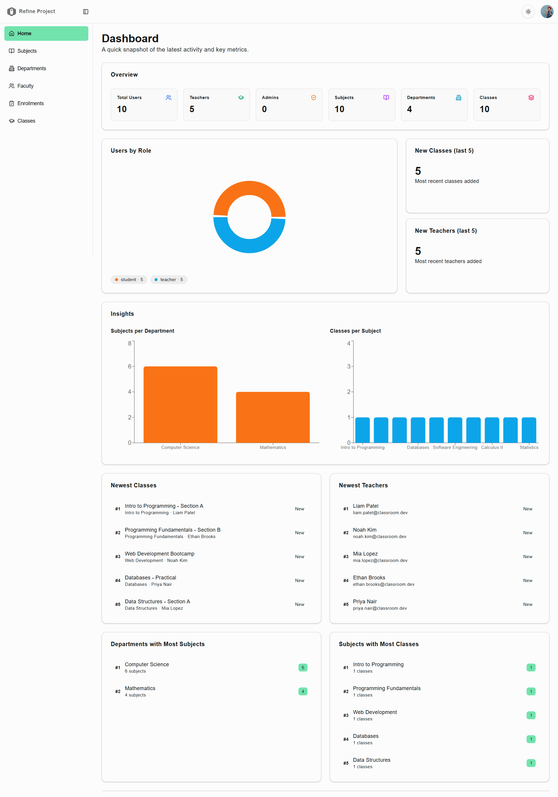
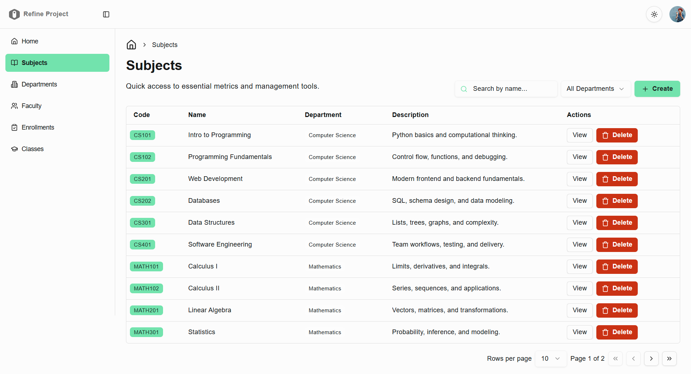
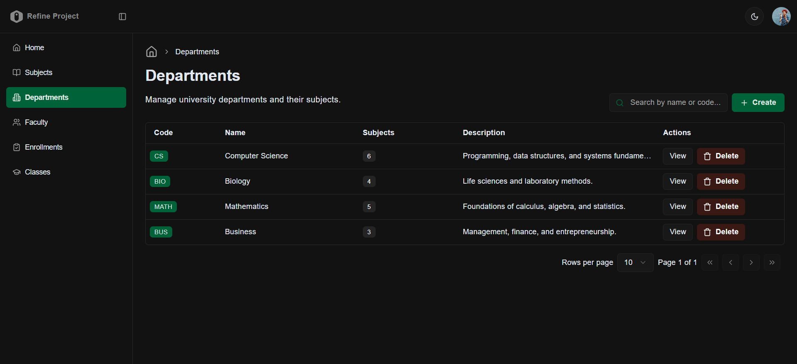
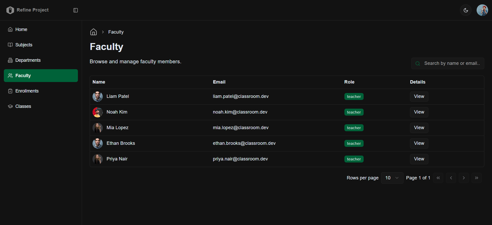
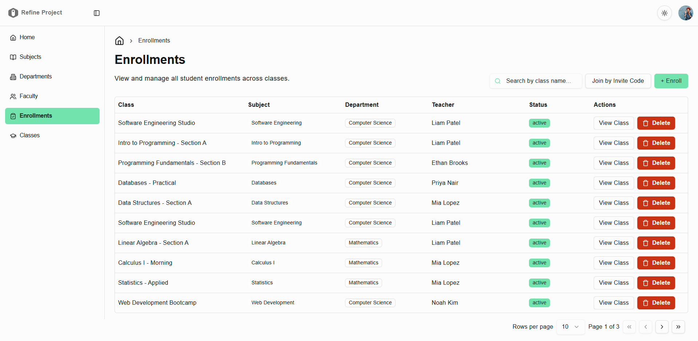
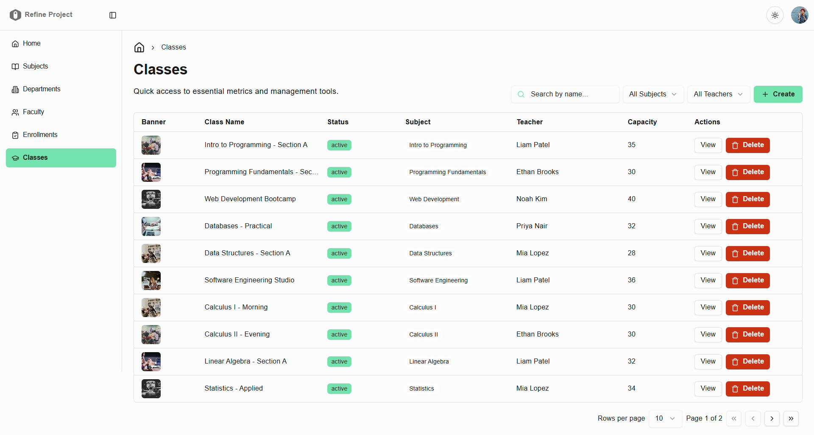
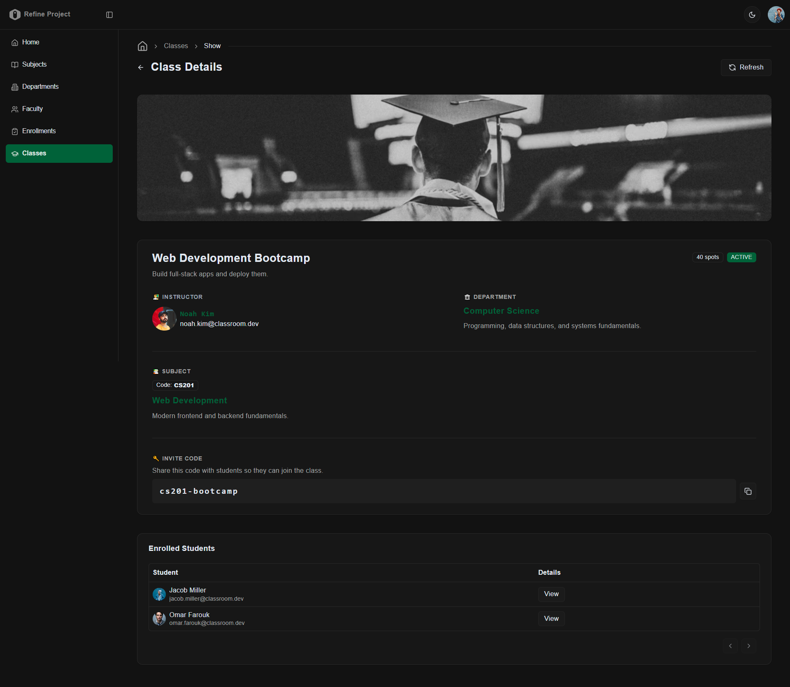
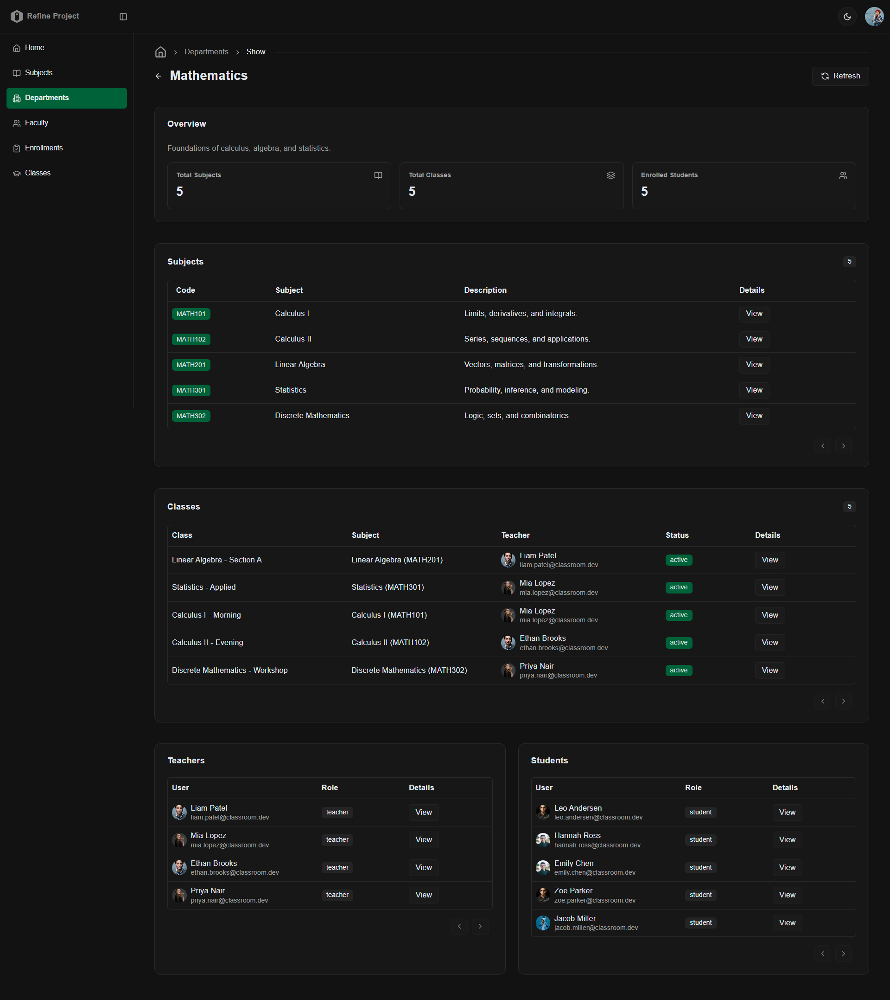

# 🎓 CampusCore - University Management Dashboard

A modern, full-stack university management platform designed to replace clunky legacy academic systems with a unified, role-based experience. From department governance to real-time enrollment with invite codes, CampusCore streamlines how universities manage departments, subjects, classes, faculty, and students.

Built with **React, Refine, Express, PostgreSQL, Drizzle ORM, and Better Auth**, this application delivers a seamless experience for administrators while giving teachers and students clear, purpose-built workflows to interact with the system.

**🔗 Live Demo:** [campuscore-app.vercel.app](https://campuscore-app.vercel.app)

### 🔑 Demo Credentials

Use any of these accounts to explore the application:

| Role | Email | Password |
|------|-------|----------|
| **Admin** | `ava.admin@classroom.dev` | `Admin#1234` |
| **Teacher** | `liam.patel@classroom.dev` | `Teach#1234` |
| **Student** | `arjun.singh@classroom.dev` | `Student#123` |

Admins see the full management dashboard. Teachers can view their classes and share invite codes. Students can join classes using invite codes like `cs101-a`, `math101-morning`, or `bio101-lab`.

---

## ✨ Features

✅ **Multi-Role Authentication** - Secure email and password authentication with role-based access control for Admins, Teachers, and Students, powered by Better Auth and scrypt password hashing.  
✅ **Real-Time Analytics Dashboard** - A unified overview of institutional health featuring live statistics on enrollment, active classes, faculty distribution, and subject breakdowns across departments.  
✅ **Complete Subject Management** - Centralized curriculum control with search, department filtering, full CRUD operations, and drill-down views into related classes and teachers.  
✅ **Department Governance** - A structural management layer that organizes subjects, classes, teachers, and students into departments with accurate enrollment counts and relationship tracking.  
✅ **Dynamic Faculty Directory** - A paginated directory of all teachers with search by name or email, profile photos via Cloudinary, and detailed views of their associated departments and subjects.  
✅ **Advanced Class Management** - Admins can create classes with banner images, set capacity limits, assign teachers, manage status, and generate unique invite codes for enrollment.  
✅ **Invite Code Enrollment System** - A Google Classroom inspired workflow where students gain access to classes by entering unique invite codes, with instant confirmation and automatic relationship mapping.  
✅ **Image Upload with Cloud Optimization** - Secure image uploads for class banners powered by Cloudinary, with automatic CDN delivery and AI-driven optimization.  
✅ **Production-Grade Security** - Rate limiting, bot detection, and shield protection against OWASP Top 10 threats via Arcjet middleware, with role-based request limits.  
✅ **Fully Responsive Design** - Optimized for desktop, tablet, and mobile with a clean, modern dark and light mode UI built on shadcn/ui and Tailwind CSS.  
✅ **Type-Safe Architecture** - End-to-end TypeScript coverage from database schemas to React components, with Zod validation on every form for bulletproof data integrity.

---

## 🔥 Tech Stack

### 🖥️ Frontend
- **React 18** with **Vite** for fast, modern frontend tooling
- **Refine** as the React framework for data-heavy admin dashboards
- **TypeScript** for complete type safety across the codebase
- **Tailwind CSS** for rapid, utility-first styling
- **shadcn/ui** built on Radix UI for accessible, reusable components
- **React Hook Form + Zod** for robust, type-safe form validation
- **TanStack Table** for powerful, performant data tables
- **Recharts** for interactive data visualizations
- **React Router** for client-side routing

### 🔧 Backend & Services
- **Node.js + Express** for a flexible, battle-tested REST API
- **PostgreSQL** via **Neon** for serverless, autoscaling cloud database
- **Drizzle ORM** for type-safe database queries and schema management
- **Better Auth** for modern authentication with session management
- **Cloudinary** for image hosting, optimization, and CDN delivery
- **Arcjet** for security, rate limiting, and bot protection
- **tsx** for TypeScript execution without a build step

### 🚀 DevOps & Deployment
- **Vercel** for frontend hosting with global CDN and CI/CD
- **Railway** for always-on backend hosting with auto-deploys
- **Neon** for serverless PostgreSQL with connection pooling
- **GitHub** for version control and continuous deployment

---

## 🎯 The Problem It Solves

Most university systems are fragmented across spreadsheets, outdated portals, and separate tools for scheduling, enrollment, and analytics. Administrators waste hours switching between systems, teachers struggle to share class information with students, and students often have no clear way to see what they are enrolled in.

CampusCore consolidates every core academic workflow into a single platform. Admins get a real-time overview of the entire institution, teachers can instantly share classes through invite codes, and students enroll in seconds without paperwork or email back-and-forth. The result is less time managing software and more time focused on actual education.

---

## 🏗️ Architecture Highlights

### 🔐 Security
- Role-based access control enforced at both the route and component level
- Scrypt password hashing with 16-byte random salts for credential security
- Arcjet middleware applies rate limits based on user role (Admin 20/min, Teacher and Student 10/min, Guest 5/min)
- Shield protection against SQL injection and OWASP Top 10 threats
- Bot detection with whitelisting for legitimate crawlers like search engines
- CORS configured with credentials support and explicit frontend origin whitelisting

### ⚡ Performance Optimized
- Server-side pagination and filtering on every list endpoint to minimize payload size
- Composite database indexes on foreign keys and frequently queried columns
- Left joins with aggregate counts for efficient relationship queries
- Cloudinary CDN delivery for images with automatic format negotiation
- Connection pooling via Neon serverless driver for zero cold start on queries

### 🧩 Scalable Schema Design
- Separation of concerns between authentication tables (user, session, account, verification) and domain tables (departments, subjects, classes, enrollments)
- Foreign key constraints with explicit cascade behavior to maintain referential integrity
- Many-to-many relationship via a dedicated enrollments bridge table
- Timestamps with automatic `on update` triggers for audit trails
- Type inference from Drizzle schemas provides end-to-end type safety

### 📊 Smart Data Pipeline
- Aggregated statistics endpoint powers the entire dashboard in a single request
- Distinct counts for accurate student enrollment per department
- Server-side sort, filter, and search operators map cleanly from frontend to database queries
- Relationship-aware queries fetch subjects, classes, teachers, and students for any department in one call

---

## 📸 Screenshots

### **Sign In Page**

### **Register Page**

### **Admin Dashboard**

### **Subjects Management**

### **Departments List**

### **Faculty Directory**

### **Enrollments Management**

### **Classes List**

### **Class Details with Invite Code**

### **Department Details**

---

## 🚀 Why This Stands Out

CampusCore is a production-grade full-stack application built with the same tools and patterns used by modern tech companies and enterprise engineering teams.

**What makes this project impressive:**

🔹 **Real, complex domain model** with seven interconnected database tables, many-to-many relationships, and role-specific workflows.  
🔹 **Full TypeScript coverage** from PostgreSQL schemas through ORM types to React components and form validation.  
🔹 **Production monitoring and security baked in** via Arcjet, not bolted on as an afterthought.  
🔹 **Decoupled architecture** with a React frontend and Express backend communicating via a clean REST API, deployed to separate infrastructure.  
🔹 **Modern authentication** using Better Auth with scrypt hashing and role-based permissions instead of hand-rolled JWT logic.  
🔹 **Scalable database design** using Drizzle ORM with proper indexes, foreign keys, and relationship definitions.  
🔹 **Polished UX details** like invite code copy-to-clipboard, role-aware UI, animated chart transitions, image upload previews, and contextual error messages.  
🔹 **Always-on deployment** on Railway and Vercel with auto-deploys from GitHub, demonstrating real-world CI/CD experience.

This project demonstrates full-stack proficiency, architectural thinking, and the ability to ship polished, secure features that real users would actually rely on.

---

Built by **Dardan Kabashi**
